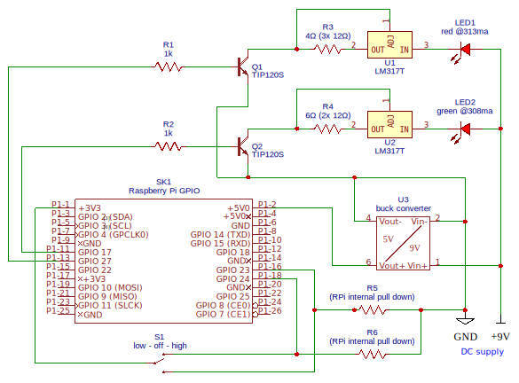

# What is this?

I built a pair of "on air" lights so that my partner and I can signal to each other when not to be interrupted.
This solves the problem of one of us (mostly me) barging in on the other while they are in the middle of a work call, zoom meeting etc.

Each box will discover any other boxes on the network and communicate automatically with each other to reach consensus about shared "status".

By default, status can be "off", "low", or "high", which are to "off", "yellow", and "red" respectively.
This can, however, be configured to support different use cases and hardware configurations. Theoretically, if you hooked up the blue LED in the RGB diode, you could use any rgb color and as many statuses as you want!

# Installation

### Install Node

On a recent PI (2+) nvm should work just fine:
```sh
sudo apt install -y nvm
nvm install 12 --lts
```

On a 1st gen Pi (and Pi Zero W which is what I ultimately used for both my boxes), this worked for me:
```sh
wget https://unofficial-builds.nodejs.org/download/release/v12.18.3/node-v12.18.3-linux-armv6l.tar.gz
tar -xzf node-v12.18.3-linux-armv6l.tar.gz
sudo cp -R node-v12.18.3-linux-armv6l/* /usr/local
```

### Install other dependencies

```sh
sudo apt install git
npm i -g yarn # you may have to use sudo if you didn't install node via nvm
yarn global add typescript
```

### Clone on-air and install dependencies

```sh
git clone https://github.com/benkrejci/on-air.git
cd on-air
./bin/install
```

### Note

The above install script sets up a systemd service, which will work on modern versions of Raspbian (as well as most Linux distros).
If this doesn't work, you need to manually set up an init script so that dist/index.js runs on startup. See [bin/.installService](./bin/installService) for reference.

## Configure

The default configuration can be found in [config/box-config.default.yml](config/config.default.yml).
The install script copies this file to config/box-config.yml so feel free to change it to suit the specific hardware configuration you are using. See [RawConfig interface](lib/config.ts#L3) for available configuration options.

# Hardware

This project requires some knowledge of driving LEDs from a Raspberry PI or other digital IO. I will describe my setup here.

## My build

This is best build I currently have. I use darlington transistors to switch the high power LED circuits from the 3.3v logic level out from Pi and constant current drivers for each of red and green led circuits.

### Components (for each box)

- Raspberry Pi Zero W
- 3W RGB LED chip [$2.95 on Adafruit](https://www.adafruit.com/product/2530)
- 2x darlington transistors (TIP120) [10 for $7 on Amazon](https://www.amazon.com/gp/product/B083TQN12B)
- 2x voltage regulator (LM317T) [25 for $8 on Amazon](https://www.amazon.com/gp/product/B07VNNHWF9)
- Resistors (1/4W)
  - 2x 1kΩ
  - 5x 12Ω
- Buck converter (for powering Pi from 9v source) [6 for $10 on Amazon](https://www.amazon.com/gp/product/B076H3XHXP)
- ON-OFF-ON rocker switch [I like this chunky one (2 for $13) but there are cheaper options](https://www.amazon.com/gp/product/B07PDQN6P8)
- 7.5-9V 1A DC power supply (any higher than 9V and you'll be dumping a lot of power into the LM317s as heat) [I used this 8.5V one $8 on Amazon](https://www.amazon.com/gp/product/B08CH9C3K6)

### Circuit



### Notes

- You could improve the efficiency and use a higher voltage power supply by replacing the LM317-resistor pairs (top right) with switching constant current regulators [like this one for $13](https://www.ledsupply.com/led-drivers/buckpuck-dc-led-drivers) but these devices are relatively expensive and you really want one for each LED that you drive.
- You could also simplify this circuit and do away with the buck converter by just using 2 power supplies: a 5v one to power the Pi and a higher voltage LED supply.
- Also FYI, the reason for the higher voltage power supply even though the LEDs themselves only drop 2.5-3.6V is that an LM317 requires at a minimum of 3V voltage drop across it with an additional 1V of headroom. So you want a minimum of 7.6V and not much higher, as the higher you go, the more power gets dumped into heat by the LM317.
- I also looked into using FETs for switching instead of darlingtons, but I don't have any on hand that switch on properly with 3V logic level input and those can be hard to find. If you are switching more powerful LEDs, though, you will likely want to use an N-channel MOSFET, possibly with a logic level shifter [like this $4 one from Adafruit](https://www.adafruit.com/product/757).