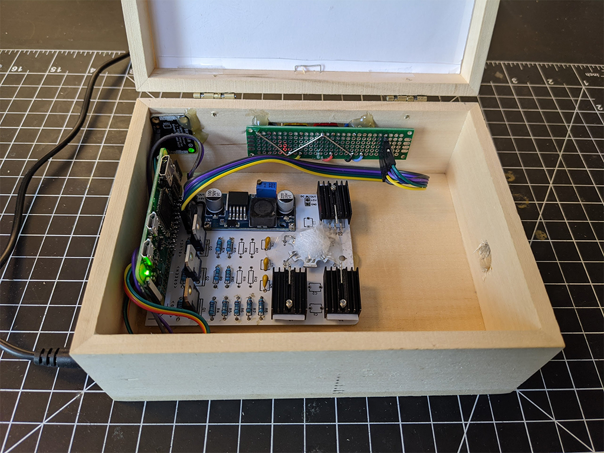

# What is this?

I built a pair of "on air" lights so that my partner and I can signal to each other when not to be interrupted.
This solves the problem of one of us (mostly me) barging in on the other while they are in the middle of a work call, zoom meeting etc.


This project ended up being a pretty good learning experience for me around circuits and specifically driving high-power LEDs. It's a good overlap of a simple idea with myriad considerations and edge cases.



Each box will discover any other boxes on the network via bonjour (zerconf, avahi) and communicate automatically with each other to reach consensus about shared "status".

By default, status can be "off", "low", or "high", or "party" which map to off, yellow, and red, and multicolored respectively.
This can, however, be configured to support different use cases and hardware configurations.

# Installation

### Install Node

On a recent PI (2+) nvm should work just fine:

```sh
sudo apt install -y nvm
nvm install 12 --lts
```

On a 1st gen Pi or Pi Zero W (which is what I ultimately used mine), you can install from unofficial builds like this:

```sh
wget https://unofficial-builds.nodejs.org/download/release/v12.20.0/node-v12.20.0-linux-armv6l.tar.xz
tar -xvf node-v12.20.0-linux-armv6l.tar.xz
sudo cp -R node-v12.20.0-linux-armv6l/* /usr/local/
```

### Install this package

```sh
npm i @benkrejci/on-air # shouldn't need to install globally, so just make sure you're in a directory you like
sudo npx on-air-install # this installs pigpio and registers the on-air-box start script as a systemd service
```

- You can then optionally alter the default config: `/etc/on-air-box.yml`
- And start the service: `sudo systemctl start on-air-box`
- To see logs: `sudo journalctl -u on-air-box`
- If you have issues, to make debugging easier, stop the service and run the script directly using: `npx on-air-box`

### Note

The above install script sets up a systemd service, which will work on modern versions of Raspbian (as well as most Linux distros).
If this doesn't work, you need to manually set up an init script so that dist/index.js runs on startup. See [bin/.installService](./bin/installService) for reference.

## Configure

An example configuration can be found in [config/config.example.yml](config/config.example.yml).
The install script copies this file to config/config.yml so feel free to change it to suit the specific hardware configuration you are using. See [RawConfig interface](lib/config.ts#L3) for available configuration options.

# Hardware

This project requires some knowledge of driving LEDs from a Raspberry PI or other digital IO. I will describe my setup here.

## My build

This is best build I currently have. I use darlington transistors to switch the high power LED circuits from the 3.3v logic level out from Pi and constant current drivers for each of red and green led circuits.

### Components (for 1 box)

-   Raspberry Pi Zero W
-   3W RGB LED chip [\$3 on Adafruit](https://www.adafruit.com/product/2530)
-   3x darlington transistors (TIP120) [10 for \$7 on Amazon](https://www.amazon.com/gp/product/B083TQN12B)
-   3x voltage regulator (LM317T) [25 for \$8 on Amazon](https://www.amazon.com/gp/product/B07VNNHWF9)
-   _Optional_ heatsink for at least the red LM317 [12 for \$6 on Amazon](https://www.amazon.com/Insulator-Rubberized-Regulator-Transistor-20mmx15mmx11mm/dp/B07PGVZ7CJ)
-   Resistors (1/4W)
    -   For 3W LED regulators:
        -   3x 1kΩ (1 for each color)
        -   5x 20Ω (for red)
        -   4x 15Ω (2 for each of green and blue)
    -   (Optional) for secondary "local status" LED:
        -   1x 80Ω red
        -   1x 120Ω green
        -   1x 50Ω blue
-   Buck converter (for powering Pi from 9v source) [6 for \$10 on Amazon](https://www.amazon.com/gp/product/B076H3XHXP)
-   Switch/buttons
    -   I ended up going with momentary push buttons [like these colorful chonks for \$6 on Adafruit](https://www.adafruit.com/product/1009)
    -   But originally when I only had 2 statuses, I used an ON-OFF-ON rocker switch [I like this thicc boy (2 for \$13) but there are cheaper options](https://www.amazon.com/gp/product/B07PDQN6P8)
-   Optional light sensor to automatically adjust brightness: [\$4.50 on Adafruit](https://www.adafruit.com/product/4681)
-   Optional secondary "local status" RGB LED: [10 for \$7 on Amazon](https://www.amazon.com/gp/product/B0194Y6MW2)
-   Some barrel jacks [5 for \$8 on Amazon](https://www.amazon.com/gp/product/B07C46XMPT)
-   7.5-9V 1A DC power supply (any higher than 9V and you'll be dumping a lot of power into the LM317s as heat) [I used this 8.5V one \$8 on Amazon](https://www.amazon.com/gp/product/B08CH9C3K6)
-   Some kind of enclosure, I cut up this wooden box [\$14 on Amazon](https://www.amazon.com/gp/product/B004I9SLEG)

Total for the fully loaded out setup is ~\$100 for 2 boxes and you'll have spare parts.

You can either print the PCB below (~\$15 for 5 boards with shipping; arrives in about a week from China) or use some blank prototyping boards.

### Circuits

#### Simple circuit

This is the simplest version of the driver circuit I made which only uses red and green and doesn't have any capacitors for decoupling.

Source: [easyeda.com/benkrejci/on-air-box](https://easyeda.com/benkrejci/on-air-box)


#### PCB circuit

Here's a PCB I made which has room for 3 LEDs if desired, as well as decoupling capacitors. There are pads for up to 5 resistors for setting the red current, and 4 for each of green and blue. Choose number and values of resistors based on desired current and power dissipation (see next section). The PCB only requires 1 layer so you can get them made pretty cheaply (\$2 for 5 on [jlcpcb.com](https://jlcpcb.com/)).

Source: [easyeda.com/benkrejci/on-air-box-2](https://easyeda.com/benkrejci/on-air-box-2)


### Resistor values and power dissipation

Here's [a very detailed explanation](https://theparanoidtroll.com/2011/01/05/constant-current-sourceload-lm317/) of using a LM317 voltage regulator to build a constant current source.

**TLDR; to find the value of resistor, use the equation `R = 1.25V / I` where `I` is the desired current in amps.**

In my example, I want the red LED to get 313ma so that it's close to its maximum brightness. So `1.25V / 0.313A = 4Ω` or 5x 20Ω resistors in parallel.

I want the green LED to get 167ma, so `1.25V / 0.167A = 7.5Ω` or 2x 15Ω resistors in parallel. I am using almost twice as much current for the red LED because green appears much brighter to the human eye and therefore a good luminous yellow needs more red than green IMO.

**To figure out the required power rating or number of resistors needed, multiply `Pr = 1.25V * I`**

So for the red circuit in my example `1.25V * 0.313A = 0.392W` is the power dissipated by my resistor, hence my choice of 5 20Ω resistors which are each rated to dissipate 1/4W of power (it is recommended to double the power rating to allow for headroom and extend the life of the components).

**Finally, let's figure out the heat that will be dissipated by the LM317. To do this, we calculate the voltage drop across it and multiply it by the current `(Vin - Vled - Vref) * I = Pu` where Vin is input voltage, Vled is voltage drop across LED, and Vref is the LM317 reference voltage of 1.25V.**

For my red LED `8.5V - 2.5V - 1.25V = 4.75V`. This is more than the minimum 3V the LM317 needs to operate, but will dissipate `4.75V * 0.313A = 1.49W` of heat. If you are putting [more than 0.25W into an LM317, you need a heatsink](http://www.reuk.co.uk/wordpress/electric-circuit/lm317t-heatsinking/).

**"My status" RGB LED**

For this smaller RGB LED I use traditional resistor current limiting since the power dissipation is so much lower.

Red resistor: `3.3V - 1.7V = 1.6V / 0.02A = ~80Ω`

Green resistor: `3.3V - 2.7V = 0.6V / 0.005A = ~120Ω`

Blue resistor: `3.3V - 3.0V = 0.3V / 0.006A = ~50Ω`

### Notes

-   You could improve the efficiency and use a higher voltage power supply by replacing the LM317-resistor pairs (top right) with switching constant current regulators [like this one for \$13](https://www.ledsupply.com/led-drivers/buckpuck-dc-led-drivers) but these devices are relatively expensive and you really want one for each LED that you drive.
-   You could also simplify this circuit and do away with the buck converter by just using 2 power supplies: a 5v one to power the Pi and a higher voltage LED supply.
-   Also FYI, the reason for the higher voltage power supply even though the LEDs themselves only drop 2.5-3.6V is that an LM317 requires at a minimum of 3V voltage drop across it with an additional 1V of headroom. So you want a minimum of 7.6V and not much higher, as the higher you go, the more power gets dumped into heat by the LM317.
-   I also looked into using FETs for switching instead of darlingtons, but I don't have any on hand that switch on properly with 3V logic level input and those can be hard to find. If you are switching more powerful LEDs, though, you will likely want to use an N-channel MOSFET, possibly with a logic level shifter [like this \$4 one from Adafruit](https://www.adafruit.com/product/757).
